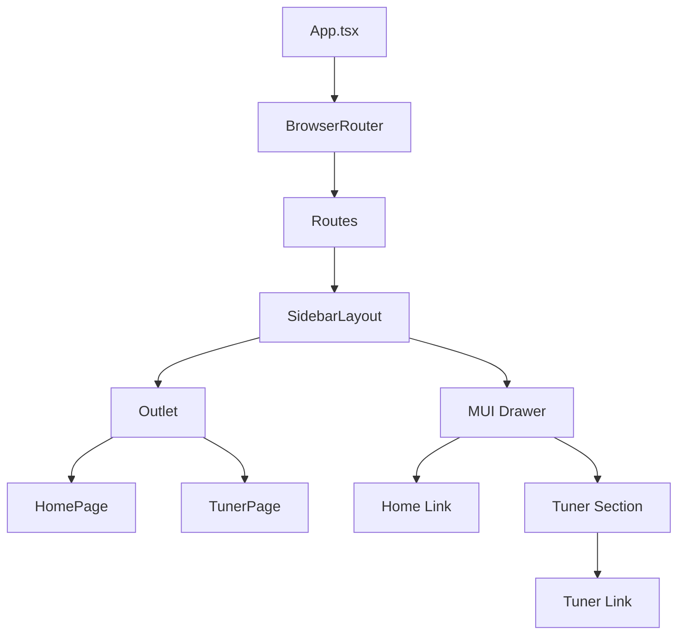

# Navigation and Sidebar Implementation Plan

The objective is to introduce a persistent side menu using Material UI (MUI) and React Router for easy navigation and future extensibility.

## Architecture

1.  **Routing**: Use `react-router-dom` to manage `/` (Home) and `/tuner` (Tuner) routes.
2.  **Layout**: A `SidebarLayout` component will wrap the main content. It will use MUI's `Drawer` component for the persistent sidebar.
3.  **Components**:
    *   `SidebarLayout`: Contains the MUI Drawer and a `Box` for the main content (`Outlet`).
    *   `HomePage`: A simple placeholder component.
    *   `TunerPage`: The current logic from `App.tsx`.

## Sidebar Structure (MUI)

-   **List Item**: `Home` (Link to `/`)
-   **Divider**
-   **List Subheader**: "Tuner"
-   **List Item**: `Pitch Detection` (Link to `/tuner`) - (or just call it "Tuner")

## Implementation Steps

1.  **Install dependencies**:
    ```bash
    npm install @mui/material @emotion/react @emotion/styled @mui/icons-material react-router-dom
    ```
2.  **Refactor components**:
    *   `src/pages/TunerPage.tsx`: Extracted from current `App.tsx`.
    *   `src/pages/HomePage.tsx`: New empty page.
    *   `src/components/SidebarLayout.tsx`: MUI-based sidebar layout.
3.  **Update `App.tsx`**:
    *   Configure `BrowserRouter` with `Routes`.
    *   Use `SidebarLayout` as the parent route.
4.  **Styling**:
    *   Adjust `App.css` or use MUI's `sx` prop to handle layout spacing (margin-left for the sidebar).

## Mermaid Diagram


